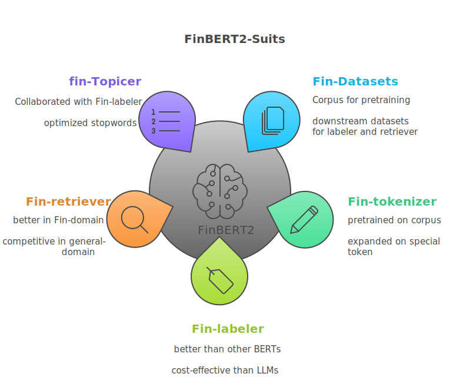

<h1 align="center">⚡️FinBERT2-Suits:中文金融文本处理定制BERTs套件 </h1>
<p align="center">
    <a href="https://github.com/mengyougithub/FinBERT2-Suits">
        
    </a>
    <a href="https://github.com/mengyougithub/FinBERT2-Suits/blob/master/LICENSE">
        
    </a>

<h4 align="center">
    <p>
        <a href=#项目背景>项目背景</a> |
        <a href=#项目介绍>项目介绍</a> |
        <a href=#快速开始>快速开始</a> |
        <a href="#模型列表">模型列表</a> |
        <a href="#Reference">Reference</a> |
        <a href="#citation">Citation</a> |
        <a href="#license">License</a> 
    <p>
</h4>




🌟Paper🌟: 敬请期待

🌟Datasets and Checkpoints🌟: 敬请期待


## 项目背景
尽管目前千亿级别大语言模型拥有强大的能力，然而在金融领域的实际部署和应用中存在以下问题：
1、在对百万级文档打标签场景下面临高推理成本和慢响应时间问题。
2、复杂专业任务如细粒度金融文本情感分类时，千亿级别LLM性能如果不经微调其性能不如BERT等专门的小型模型好。
3、面对涉及超大规模文本数据集的任务：如检索与主题建模，LLM受限于窗口大小和推理成本没有成熟的解决方案。
4、模型维护和适配成本高：如大量私有领域数据如何高效利用来提高模型性能、模型内部知识更新，tokenizer如何适配金融领域。
5、私有化部署和用户数据隐私问题。

基于0.1Ｂ参数量的FinBERT2可以缓解上述问题：
1、轻量化，降低成本：在对百万级文档打标签场景下，模型内部知识更新、重新训练，向量数据库构建等场景下高效推理或训练。
2、大规模领域训练，更高性能：虽然没有直接写提示词方便，但是下游领域任务性能得到普遍提升。
3、广泛的任务适用：除了传统的分类任务，还可经过对比学习微调用于检索任务和主题建模任务。

## 项目介绍

FinBERT2-Suits 是熵简科技基于丰富的金融领域数据开发的面向中文金融文本处理定制的BERTs套件，在金融文本分类、检索、主题建模上拥有更好的性能。相比四年前熵简科技发布的[FinBERT1](https://github.com/valuesimplex/FinBERT)，我们有如下升级：
###  🧱更开源的金融领域数据集(Fin-datasets)
- 包含研报、新闻、公告等丰富的金融领域无监督语料
- 各种金融领域下游任务数据集
###  🏆深度定制的基座模型
- 分词器(Fin-tokenizer)和基座模型(Fin-RoBERTa)在60B金融文本语料上预训练
### 🌐 更广阔的下游任务适配
- 涵盖基于BERT架构的各种金融领域下游任务:
  - 🔢 包含sequence/token classification在内的多种分类任务 (Fin-labeler)
  - 📚  适用于 RAG的检索任务 (Fin-retriever)
  - 🗃️ 主题建模任务 (Fin-topicer)

## File Structure
```shell
.
├── dataset  # * dataset path

└── model  # * 
    ├── 

```

## 更新
- 12/15/2024：创建github项目
                             |

## Reference:
我们的套件基于下列开源项目开发，关于更多细节，可以参考原仓库：

1、FlagEmbedding(https://github.com/FlagOpen/FlagEmbedding): 是一个开源项目,旨在开发检索和检索增强的语言模型。

2、SentencePiece (https://github.com/google/sentencepiece): Google开发的无监督文本分词器,用于基于神经网络的文本生成任务。

3、RoBERTa中文预训练模型 (https://github.com/brightmart/roberta_zh): 一个采用RoBERTa方法在大规模中文语料上进行预训练的中文语言模型。

4、BERTopic (https://github.com/MaartenGr/BERTopic): 利用BERT和类TF-IDF来创建可解释的主题模型。

5、FinBERT (https://github.com/valuesimplex/FinBERT): 熵简科技第一代FinBER

## Citation

如果您觉得我们的工作有所帮助，请考虑点个星 :star: 和引用以下论文:
```
@misc{
}
```
## License
基于[MIT License](LICENSE)开源协议。
